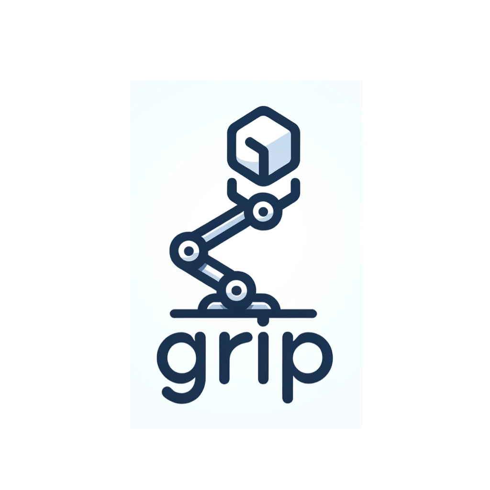

# grip 

[](https://github.com/alexjoedt/grip/actions/workflows/go.yml)

<p align="center">
  
  <h3 align="center">grip</h3>
  <p align="center">Installing effortlessly single-executable releases from GitHub projects </p>
</p>

GRIP is a simple CLI tool for installing the latest executable releases from GitHub.

For examlpe:
- github.com/restic/restic
- github.com/go-task/task
- github.com/ogham/exa

```bash
$ grip install github.com/restic/restic
```

This command will install restic in `~/.grip/bin/restic`.

Dont forget to add the grip bin path to your `PATH` variable.

Alternatively you can set a diffrent path with the flag `--destination` or `-d`.

```bash
$ sudo grip install -d /usr/local/bin github.com/restic/restic
```

## Restrictions

The project release must be a standalone executable.

Currently, only github.com is supported.

Supported package types:
- `tar.gz`
- `tar.bz2`
- `zip`
- `tar.xz`
- `bz2`

The asset's filename must contain both the architecture and the operating system.

## Disclaimer

This tool is early stage. It might have issues, and some features like updating or uninstalling are not there yet. 
I made this tool because I wanted an easy way to install CLI tools like restic, exa and more on my Linux and macOS computers directly from the project's website. Please be patient with its limits.

## Contributions

All contributions are warmly welcomed.
