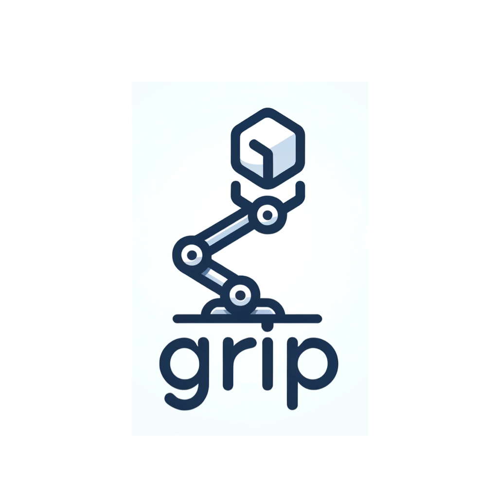

# grip


[](https://github.com/alexjoedt/grip/actions/workflows/build.yml)
[](https://github.com/alexjoedt/grip/releases)
[](https://codecov.io/gh/alexjoedt/grip)

<p align="center">
  
  <h3 align="center">grip</h3>
  <p align="center">Installing effortlessly single-executable releases from GitHub projects </p>
</p>

---

grip installs command line tools straight from their GitHub releases. It picks the release asset for your platform, checks it against the digest GitHub publishes, and links the executable into `~/.grip/bin`. It keeps track of what it installed, so tools can be updated, pinned, rolled back, verified and reproduced on another machine.

```bash
grip install restic/restic
grip install go-task/task
grip install sharkdp/fd@v10.2.0
```

## Install

grip installs itself. Download the archive for your platform, let that grip install grip, and add `~/.grip/bin` to your `PATH`:

```bash
os=$(uname -s)
arch=$(uname -m | sed 's/aarch64/arm64/')
curl -fsSLO "https://github.com/alexjoedt/grip/releases/latest/download/grip_${os}_${arch}.tar.gz"
tar -xzf "grip_${os}_${arch}.tar.gz" grip
./grip install alexjoedt/grip
rm grip "grip_${os}_${arch}.tar.gz"

echo 'export PATH="$HOME/.grip/bin:$PATH"' >> ~/.profile
```

Release archives carry a build attestation. To check the download before unpacking it (optional, needs the GitHub CLI):

```bash
gh attestation verify "grip_${os}_${arch}.tar.gz" --repo alexjoedt/grip
```

## Supported platforms

- Linux and macOS on amd64 and arm64.
- Releases on github.com.
- Assets as `.tar.gz`/`.tgz`, `.tar.xz`, `.tar.bz2`/`.tbz`, `.zip`, single files compressed with `.gz`, `.xz` or `.bz2`, and bare executables.
- One executable per package.

## Commands

Every command accepts `--quiet`/`-q` (no progress or status lines, warnings and errors stay) and `--verbose`.

### install

```bash
grip install owner/repo              # latest release
grip install owner/repo@v1.2.3       # this tag, and pin it
grip install github.com/owner/repo   # same package as owner/repo
grip install --alias rg BurntSushi/ripgrep
```

The executable is stored in `~/.grip/pkgs/<name>/<tag>/` and linked as `~/.grip/bin/<name>`. The name is the repository name unless `--alias`/`-a` sets another one.

Installing a package that is already installed does nothing. A different `@tag` switches to that tag and pins it. `--force`/`-f` installs again: the latest release, or the pinned tag of a pinned package.

grip selects the asset that matches your OS and architecture; on Linux it prefers musl builds. When several assets or several executables fit equally well, the error lists a ready-to-paste command for each candidate:

```bash
grip install --asset 'tool-*-linux-gnu.tar.gz' owner/repo   # asset name or glob
grip install --bin toolctl owner/repo                       # executable inside the archive
```

Both choices are remembered for updates. `--verbose` shows every candidate and why it was dropped.

### update

```bash
grip update fd restic   # the named packages
grip update --all       # everything except pinned packages
```

A package that is already at the latest release is not downloaded again. `update <name>` on a pinned package fails and names `grip unpin`; `--all` skips pinned packages and says so. A failure does not stop the remaining packages; the summary line counts them and the exit status is 1. `--asset` and `--bin` replace the remembered choice and need exactly one name.

### outdated

```bash
grip outdated
grip outdated --json
```

Lists packages whose tag differs from the latest release, pinned ones included.

### pin, unpin, rollback

```bash
grip pin fd        # updates leave fd at its tag
grip unpin fd
grip rollback fd   # back to the previous version, pinned
```

grip keeps the previous version of every package. `rollback` works offline, checks the previous executable against its recorded hash and toggles between the two versions.

### ls, info

```bash
grip ls
grip ls --filter name=^rest   # fields: name, tag, repo, path
grip ls --json
grip info fd
grip info fd --json
```

### verify

```bash
grip verify          # all packages
grip verify fd rg
grip verify --json
```

Hashes the installed executables and compares them with the hashes recorded at install time. It works offline and exits 1 when an executable was modified or is missing.

### remove

```bash
grip remove fd
grip remove --dry-run fd   # print what would be removed
grip remove --force fd     # no confirmation
grip remove --all
```

### export, sync

```bash
grip export > tools.json   # on machine A
grip sync tools.json       # on machine B
grip export | ssh host grip sync -
```

`export` prints a manifest with repository, tag, pin, asset and digest of every package. `sync` installs the missing ones and switches the others to the recorded tag and pin; packages that are not in the manifest stay untouched. On the same platform the downloads must match the recorded digests. On another platform grip selects the asset for that platform, verifies it against GitHub's digest and drops a recorded `--asset` choice with a warning.

### self-update, version

```bash
grip self-update
grip version
```

`self-update` only moves forward and requires a published digest. A grip that was installed by grip is updated like any other package, pin included.

### completion

```bash
source <(grip completion bash)   # .bashrc, needs bash-completion
source <(grip completion zsh)    # .zshrc
grip completion fish > ~/.config/fish/completions/grip.fish
```

## Verification

GitHub publishes a SHA-256 digest for release assets. grip compares every download with it before anything reaches `~/.grip/bin`; on a mismatch nothing is installed and the exit status is 1.

An asset without a published digest (older releases) is installed with a warning, `<asset> has no published digest, recording <hash>`, and `grip info` shows the digest source `none`. Either way the recorded digest pins the asset: a later download of the same tag and asset that differs is refused. The way out is `grip remove` and a fresh install.

Downloads are aborted when no data arrives for 30 seconds or more data arrives than the release declares. Archives that unpack to more than 2 GiB or 100 000 entries are rejected.

## Environment

| Variable | Effect |
|---|---|
| `GRIP_HOME` | grip's directory, an absolute path. Default `~/.grip`. |
| `GITHUB_TOKEN` | Sent to the GitHub API only, raises the limit of 60 requests per hour. A rejected token is an error; grip does not fall back to anonymous requests. Private repositories are not supported. |

## Scripting

Data goes to stdout (`ls`, `outdated`, `info`, `verify`, `export`), everything else to stderr. Without a terminal no progress bar is drawn.

Exit status is 0 when the command did what was asked and 1 otherwise. 1 includes: `verify` finding a modified or missing executable, an update of several packages where one failed, `update` of a pinned package, an exhausted API rate limit, `outdated` with a failed lookup, an unknown package name, a usage error, and a declined or unanswered `remove` prompt. `outdated` finding newer releases, `update` of a current package and `install` of an installed one exit 0.

## Migrating from v1

```bash
grip self-update    # with grip v1.2.0
grip update --all   # once, with the new grip
```

- `grip.json` is converted by the first command that changes it; the original stays next to it as `grip.json.v1`.
- Packages installed by v1 stay where they are, without a recorded download digest, until they are updated. `grip update --all` moves the outdated ones into the new layout; `grip install --force owner/repo` does it for a single package right away.
- If grip v1 was installed by grip, its entry still says v1.2.0 after the self-update. `grip update --all` corrects that.
- `--tag` is gone: `grip install owner/repo@tag`.
- Executables live in `~/.grip/pkgs/<name>/<tag>/`, with symlinks in `~/.grip/bin`.
- grip no longer treats `sudo` specially. It works per user; `GRIP_HOME` is the only way to move its directory.
- There are no Windows and no 386 builds anymore.
- A home that still holds a `grip.lock` from before v1.1 needs one run of grip v1.1 or v1.2 first.
- v1.2.0 is the last v1 release.

## Contributions

All contributions are warmly welcomed.
